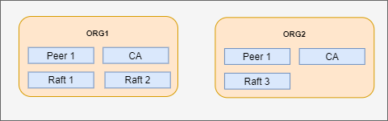

# hyperledger-fabric-scaffold

This is a scaffold to start a Hyperledger Fabric Project 

  

Instructions to get things started
---------------------------------------------
- [Installation](installation/)
- [Hyperledger Fabric Network](network/config)
- [Start the network](network/bin)
- [Sample Chaincodes](gocc/src/github.com/tharindupr/sample)
- [Run the API](api)

